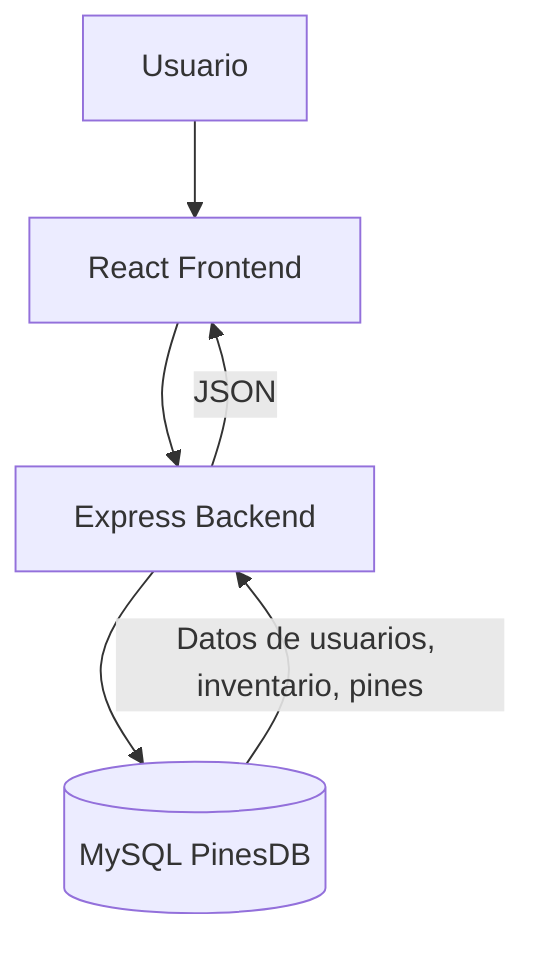

# MANUAL PARA QUE EL PROYECTO CORRA EN TU COMPU
# 📌 PinesApp – Backend + Base de Datos + Frontend

Este proyecto permite **crear, gestionar e imprimir pines** 🎨, con control de inventario y consumo de materia prima.

---

## ⚡ Requisitos

Antes de comenzar, asegúrate de tener instalado:

- [Node.js](https://nodejs.org/) (v18 o superior)  
  ```bash
  node -v
  npm -v
  ```
- [MySQL Server 8](https://dev.mysql.com/downloads/installer/)  
  - Usuario: `root`  
  - Contraseña: definida en tu instalación  
- Git (opcional, para clonar el repo)  

---

## 📥 Instalación del Proyecto

### 1️⃣ Clonar o descargar el proyecto
```bash
git clone https://github.com/tu-repo/PinesApp.git
```

O descarga el ZIP y descomprímelo en tu PC.

---

### 2️⃣ Crear la Base de Datos

El archivo SQL ya está en:  
```
backend/database/PinesDB.sql
```

Ejecuta en Windows (ajusta la ruta si es distinta):

```bash
"C:\Program Files\MySQL\MySQL Server 8.0\bin\mysql.exe" -u root -p < "C:\Users\TU_USUARIO\Desktop\PinesApp\backend\database\PinesDB.sql"
```

👉 Esto creará la base `PinesDB` con todas las tablas necesarias.

---

### 3️⃣ Verificar la Base

Entra a MySQL:

```bash
"C:\Program Files\MySQL\MySQL Server 8.0\bin\mysql.exe" -u root -p
```

Dentro de MySQL:

```sql
SHOW DATABASES;
USE PinesDB;
SHOW TABLES;
SELECT * FROM usuarios;
```

---

### 4️⃣ Configurar el Backend

Ve a la carpeta `backend`:

```bash
cd PinesApp/backend
```

Instala dependencias:

```bash
npm install
```

Edita el archivo `backend/config/db.js` y pon tu contraseña MySQL:

```js
const db = mysql.createPool({
  host: "localhost",
  user: "root",
  password: "TU_CONTRASEÑA",
  database: "PinesDB"
});
```

---

### 5️⃣ Levantar el Backend

Para producción:
```bash
npm start
```

Para desarrollo (se reinicia solo con cambios):
```bash
npm run dev
```

Servidor disponible en:
```
http://localhost:4000
```

---

### 6️⃣ Endpoints de prueba

- Bienvenida → [http://localhost:4000/](http://localhost:4000/)  
- Usuarios → [http://localhost:4000/api/testdb/usuarios](http://localhost:4000/api/testdb/usuarios)  
- Inventario → [http://localhost:4000/api/inventario](http://localhost:4000/api/inventario)  
- Producción (POST en Postman):  
  ```
  http://localhost:4000/api/produccion
  ```
  Body JSON:
  ```json
  {
    "url_imagen": "http://localhost/uploads/spiderman.png",
    "etiquetas": "superheroes",
    "tamano": "grande",
    "cantidad": 12,
    "id_usuario": 1
  }
  ```

---

### 7️⃣ Frontend

Ve a la carpeta `frontend`:

```bash
cd ../frontend
```

Instala dependencias:
```bash
npm install
```

Instala axios (si no está):
```bash
npm install axios
```

Levanta el frontend:
```bash
npm start
```

Disponible en:
```
http://localhost:3000
```

---

## 🔄 Flujo del sistema



---

## 🎉 ¡Listo!
- Backend corriendo en → `http://localhost:4000`  
- Frontend corriendo en → `http://localhost:3000`  
- Base de datos lista con tablas y datos iniciales ✅  


### ==============================================================================================

# Getting Started with Create React App

This project was bootstrapped with [Create React App](https://github.com/facebook/create-react-app).

## Available Scripts

In the project directory, you can run:

### `npm start`

Runs the app in the development mode.\
Open [http://localhost:3000](http://localhost:3000) to view it in your browser.

The page will reload when you make changes.\
You may also see any lint errors in the console.

### `npm test`

Launches the test runner in the interactive watch mode.\
See the section about [running tests](https://facebook.github.io/create-react-app/docs/running-tests) for more information.

### `npm run build`

Builds the app for production to the `build` folder.\
It correctly bundles React in production mode and optimizes the build for the best performance.

The build is minified and the filenames include the hashes.\
Your app is ready to be deployed!

See the section about [deployment](https://facebook.github.io/create-react-app/docs/deployment) for more information.

### `npm run eject`

**Note: this is a one-way operation. Once you `eject`, you can't go back!**

If you aren't satisfied with the build tool and configuration choices, you can `eject` at any time. This command will remove the single build dependency from your project.

Instead, it will copy all the configuration files and the transitive dependencies (webpack, Babel, ESLint, etc) right into your project so you have full control over them. All of the commands except `eject` will still work, but they will point to the copied scripts so you can tweak them. At this point you're on your own.

You don't have to ever use `eject`. The curated feature set is suitable for small and middle deployments, and you shouldn't feel obligated to use this feature. However we understand that this tool wouldn't be useful if you couldn't customize it when you are ready for it.

## Learn More

You can learn more in the [Create React App documentation](https://facebook.github.io/create-react-app/docs/getting-started).

To learn React, check out the [React documentation](https://reactjs.org/).

### Code Splitting

This section has moved here: [https://facebook.github.io/create-react-app/docs/code-splitting](https://facebook.github.io/create-react-app/docs/code-splitting)

### Analyzing the Bundle Size

This section has moved here: [https://facebook.github.io/create-react-app/docs/analyzing-the-bundle-size](https://facebook.github.io/create-react-app/docs/analyzing-the-bundle-size)

### Making a Progressive Web App

This section has moved here: [https://facebook.github.io/create-react-app/docs/making-a-progressive-web-app](https://facebook.github.io/create-react-app/docs/making-a-progressive-web-app)

### Advanced Configuration

This section has moved here: [https://facebook.github.io/create-react-app/docs/advanced-configuration](https://facebook.github.io/create-react-app/docs/advanced-configuration)

### Deployment

This section has moved here: [https://facebook.github.io/create-react-app/docs/deployment](https://facebook.github.io/create-react-app/docs/deployment)

### `npm run build` fails to minify

This section has moved here: [https://facebook.github.io/create-react-app/docs/troubleshooting#npm-run-build-fails-to-minify](https://facebook.github.io/create-react-app/docs/troubleshooting#npm-run-build-fails-to-minify)
